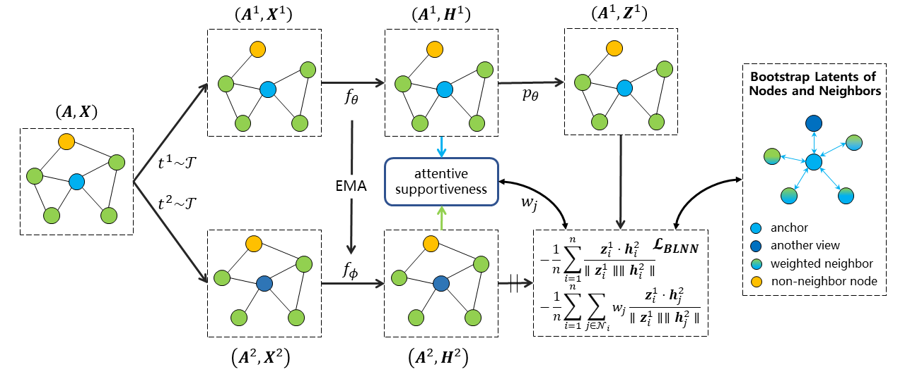

# Bootstrap Latents of Nodes and Neighbors for Graph Self-Supervised Learning

Official Implementation of [Bootstrap Latents of Nodes and Neighbors for Graph Self-Supervised Learning (ECML-PKDD 2024)](https://cloudy1225.github.io/papers/ECMLPKDD24-BLNN.pdf).


## Abstract



**Figure 1: Overview of our proposed BLNN method.** Given a graph, we first generate two different views using augmentations $t^1,t^2$. From these, we use encoders $f_{\theta}, f_\phi$ to form online and target node representations $\boldsymbol{H}^1, \boldsymbol{H}^2$. They are then fed into the attention module to compute the supportiveness $w_j$ of the neighbor $v_j$ w.r.t. the anchor node $v_i$. The predictor $p_\theta$ uses $\boldsymbol{H}^1$ to form a prediction $\boldsymbol{Z}^1$ of the target $\boldsymbol{H}^2$. The final objective is computed as a combination of the alignment of node-itself pairs and the supportiveness-weighted alignment of node-neighbor pairs. Note that the alignment is achieved by maximizing the cosine similarity between corresponding rows of $\boldsymbol{Z}^1$ and $\boldsymbol{H}^2$, flowing gradients only through $\boldsymbol{Z}^1$. The target parameters $\phi$ are updated as an exponentially moving average of $\theta$.


## Dependencies

- torch
- torch_scatter
- torch_geometric


## Training

All the configuration files can be found in [config](./config). And use the following command to train on the Computer dataset:

```bash
python train.py --flagfile=config/amazon-computers.cfg
```

Flags can be overwritten:

```bash
python train.py --flagfile=config/amazon-computers.cfg --tau=1.0
```


## Acknowledgements

The code is implemented based on [bgrl](https://github.com/nerdslab/bgrl).


## Citation

If you find the code useful for your research, please consider citing our work:

```
@inproceedings{liu2024bootstrap,
  title={Bootstrap Latents of Nodes and Neighbors for Graph Self-Supervised Learning},
  author={Liu, Yunhui and Zhang, Huaisong and He, Tieke and Zheng, Tao and Zhao, Jianhua},
  booktitle={Joint European Conference on Machine Learning and Knowledge Discovery in Databases},
  year={2024},
  organization={Springer}
}
```

